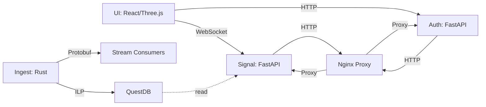

# NEXUS

Real-time market intelligence platform with deterministic sentiment analysis, technical indicators, and a spatial 3D data interface.

## Stack

| Layer | Tech |
|-------|------|
| Ingestion | Rust + Tokio + Protobuf |
| Stream/TSDB | QuestDB |
| Auth | Python + FastAPI + PostgreSQL + bcrypt + TOTP |
| Signal | Python + FastAPI + rule-based sentiment + momentum RSI |
| UI | React 18 + TypeScript + Vite + Three.js + Zustand |

## Architecture



## Quick Start

```bash
# 1. Environment
cp .env.example .env
# Edit .env and set a strong SECRET_KEY

# 2. Run everything
docker-compose up --build

# 3. Open UI
open http://localhost

# 4. API docs
open http://localhost/api/auth/docs   # Auth
open http://localhost/api/signal/docs   # Signal
```

## Tests

```bash
cd auth && pytest
cd signal && pytest
cd ingest && cargo test
```

## Project Structure

```
nexus/
├── docker-compose.yml
├── .env.example
├── README.md
├── proto/
│   └── market_data.proto
├── services/
│   ├── auth/
│   ├── signal/
│   └── ingest/
├── ui/
│   └── src/
│       ├── components/
│       ├── hooks/
│       └── store/
└── db/
    └── init.sql
```
