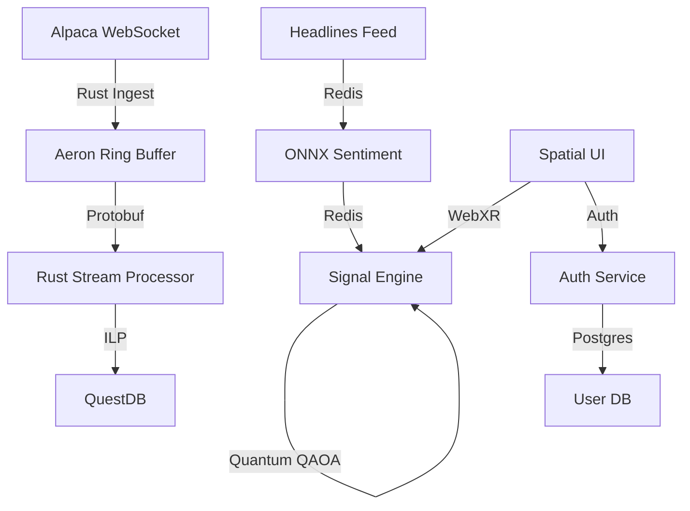

# NEXUS: Institutional-Grade Trading Intelligence

NEXUS is an elite, high-performance market intelligence platform designed for institutional quantitative desks. It features real-time data ingestion, quantum-optimized regime detection, and a spatial 3D data interface for immersive trade monitoring.

## 🚀 Elite Tech Stack

| Layer | Technology | Key Features |
|-------|------------|--------------|
| **Ingestion** | Rust (Tokio) | Alpaca WebSocket, Aeron Ring Buffer, Protobuf |
| **Stream Processing** | Rust (Arroyo) | Real-time OHLCV aggregation, Low-latency native pipeline |
| **Database** | QuestDB / Postgres | Hybrid SQL/Timeseries storage, secured internal networking |
| **Intelligence** | Python / ONNX | **FinBERT** sentiment (CPU-optimized), **PennyLane** Quantum QAOA |
| **Security** | Python / FastAPI | **Argon2-ID** hashing, AI Adaptive Firewall, TOTP 2FA |
| **Spatial UI** | React / WebXR | **Three.js** 3D visualization, **WebXR AR** mode, Zustand state |

## 🏗️ Architecture



## 🛠️ Getting Started

1.  **Environment Setup**:
    ```bash
    cp .env.example .env
    # Add your ALPACA_API_KEY and set a strong SECRET_KEY
    ```

2.  **Launch the Platform**:
    ```bash
    docker-compose up --build
    ```

3.  **Access Points**:
    - **Spatial Dashboard**: [http://localhost](http://localhost)
    - **Auth API Docs**: [http://localhost/api/auth/docs](http://localhost/api/auth/docs)
    - **Signal API Docs**: [http://localhost/api/signal/docs](http://localhost/api/signal/docs)

## 🛡️ Security & Performance

- **Argon2-ID**: State-of-the-art password hashing.
- **AI Adaptive Firewall**: Real-time anomaly detection on all authentication routes.
- **WebXR AR**: Immersive 3D data visualization for spatial computing environments.
- **Quantum Regime Detection**: PennyLane-powered QAOA for portfolio optimization.

## 🧪 Testing

```bash
cd auth && pytest
cd signal && pytest
cd ingest && cargo test
```
